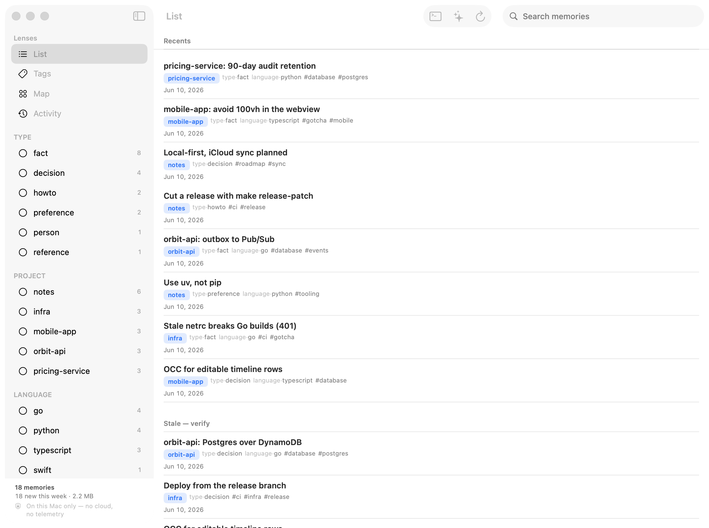

# Engram

A local-first memory app for macOS with a CLI that Claude Code hooks into to
store and recall content. The app is a native `NavigationSplitView` (ADR 0016):
a sidebar switches lenses (List / Tags / Map / Activity) and, in List,
filters by facet (`type:` / `project:` / `language:`); the detail column shows
the lens (List = search Top Hit + Recents/Most-used/Stale/Untagged shelves over
authored titles; Tags = a faceted list of all tags, each expandable to its
memories; Map = a **memory-memory shared-tag graph** — memories are nodes, an
edge joins two that share a tag, force-laid-out, common tags de-emphasized by
idf; selecting a memory highlights it and its neighborhood — ADR 0019); a
trailing inspector views/edits the selected memory. Tags and a memory's source
are clickable everywhere: tapping one jumps to that tag in the Tags lens. The
`engram` CLI is the bridge the hooks shell out to.

**Website:** [dakl.github.io/engram](https://dakl.github.io/engram/) — overview and the latest macOS download.



## Architecture

```
engram/                      Swift Package (the brains — builds & tests on CLI)
├── Sources/
│   ├── CSQLite/             Vendored SQLite 3.53.1 + sqlite-vec 0.1.9 (static C target)
│   ├── EngramCore/          Domain models, store, embeddings, ranking
│   └── engram/              The `engram` CLI (store / fetch / stats / hook ...)
├── Tests/EngramCoreTests/
└── Engram/                  Xcode macOS app — thin SwiftUI shell over EngramCore
    └── Engram/              ContentView (dashboard), EngramModel, ...
```

- **Storage:** SQLite with the `sqlite-vec` extension compiled in statically.
  Memory `content` is **Markdown** (a short `# Title` then the fact) — it reads
  well both when injected into Claude's context and, eventually, rendered in the app.
- **Titles & facets (ADR 0013/0014):** each memory carries an optional one-line
  `title` (model-written at store time, editable in the app) shown in lists; tags
  follow a reserved `key:value` convention (`type:` / `project:` / `language:`)
  parsed into the faceted home's filter rail, while freeform tags stay freeform.
  `project` folds in the `source` capture origin and is multi-valued.
- **Hybrid search (ADR 0004):** every `fetch` fuses **semantic** (sqlite-vec
  cosine over the embedder's vectors) and **lexical** (FTS5/BM25 keyword) results
  with Reciprocal Rank Fusion, then blends in recency/frequency. Lexical catches
  the exact terms (identifiers, proper nouns) embeddings can miss.
- **Embeddings (ADR 0012):** on-device via Apple's transformer-based
  `NLContextualEmbedding` (macOS 14+), mean-pooled — no API keys, no third-party
  model, usable from the CLI. Falls back to `NLEmbedding` until the contextual
  model's assets download. (See *Embedding quality* below.)
- **Shared store:** the app and the CLI both read/write one database at
  `~/Library/Application Support/Engram/engram.sqlite`. Development and
  production share this one store — memories are personal knowledge, not app
  state, and recall is only meaningful against real data. (Unit tests use
  isolated temporary databases.)
- **App rendering:** the inspector renders memory content via [swift-markdown-ui](https://github.com/gonzalezreal/swift-markdown-ui)
  (full GFM: tables, fenced code, lists, blockquotes). It's the app target's only
  third-party dependency.
- **Distribution:** the macOS app is **not sandboxed** (ADR 0003) — it's a
  developer-tool that bundles the `engram` CLI at `Contents/Helpers/engram`
  (built fresh on every app build; `Helpers/`, not `MacOS/`, because `engram`
  would collide with the app binary `Engram` on case-insensitive APFS) and
  installs the CLI, hook, and skills via its toolbar. A future iOS companion is
  a separate, sandboxed target.
- **Sync-friendly schema:** stable UUIDs, `created/updated/last_accessed`
  timestamps, `access_count`, and soft deletes (`deleted_at`) — so a future
  CloudKit mirror + iOS companion can diff cleanly. An `events` table records
  every create/access/update/delete for analytics.

## Build & test

```bash
make build      # build the package + CLI (debug)
make test       # run the EngramCore tests
make install    # build the release CLI and install it to /usr/local/bin/engram
make help       # list all targets
```

Open `Engram/Engram.xcodeproj` in Xcode to run the app (it depends on the local
package automatically). The app **bundles a freshly-built `engram`** at
`Contents/Helpers/engram` via a build phase, and its toolbar can install the CLI +
integration. For a terminal-only workflow, `make install` builds and installs
the CLI to `/usr/local/bin` directly.

## Releases & updates

Engram is distributed directly (Developer ID + notarization, not the App Store)
and updates itself via [Sparkle](https://sparkle-project.org/) — see
[ADR 0010](docs/adr/0010-app-updates-via-sparkle.md). The app's **Settings ▸
Updates** pane (and the *Check for Updates…* menu item) check the appcast at
`https://dakl.github.io/engram/appcast.xml`; background checks run every 6 h.

Cut a release locally — the preflight gate refuses to release a dirty or
unpushed tree:

```bash
make release-patch   # bump x.y.Z, tag vX.Y.Z, push
make release-minor   # bump x.Y.0
make release-major   # bump X.0.0
```

Pushing the tag triggers `.github/workflows/release.yml`, which (on a free
public-repo macOS runner) archives, signs, **notarizes**, staples, signs the
archive for Sparkle, publishes a GitHub Release, and updates
`docs/appcast.xml` on GitHub Pages. It needs these repo secrets: `APPLE_ID`,
`APP_SPECIFIC_PASSWORD`, `APPLE_TEAM_ID`, `CSC_LINK` (base64 of the Developer ID
`.p12`), `CSC_KEY_PASSWORD`, and `SPARKLE_PRIVATE_KEY`.

## CLI usage

```bash
engram store "Staging deploys run from the release branch" --tags infra,ci --source notes
engram fetch "how do staging deploys work?" --limit 5 [--json]
engram update <uuid> [--content "..."] [--tags a,b] [--source repo] \
                     [--verifiability <class>] [--check-anchor <path>]   # re-embeds
engram stats [--json]
engram list  [--limit 100] [--json]
engram activity [--since 1h] [--source recall|fetch|store|update|delete|...] [--json]  # reads + writes lookback
engram delete <uuid>
engram verify [--json]               # cheap deterministic checks; one verdict per active memory
engram verified <uuid> [--confidence 0..1] [--json]                  # mark a memory verified now
engram supersede <old-uuid> "<new content>" --reason "<why>" [--tags a,b] [--source repo] [--json]  # replace, keeping history
engram install                       # symlink /usr/local/bin/engram → this binary
engram setup [--hooks] [--skills]    # install the recall hook and/or the skills
```

Pass `--json` for machine-readable output (what hooks/scripts should use).

## Claude Code integration

Recall and store use different mechanisms because they have opposite ergonomics
(ADR 0001, with the recall surface updated by ADR 0005).

### Recall — gated, per-request hook

A `UserPromptSubmit` hook runs `engram hook recall` before each prompt: it
hybrid-searches with the prompt as the query and injects only the *confident*
matches (top ≤3), soft-framed, and **read-only with respect to ranking** so it
never inflates `access_count`. The confidence gate (`RecallGate`) is calibrated
per embedder — its distance thresholds are tuned to the live model's scale via
the offline eval (`swift run engram-eval`), ADR 0021.
Off-topic prompts inject nothing — it exits 0 silently, so it can't block or
spam. (It does record a *retrieval-activity* row — see below — which is
decoupled from ranking, ADR 0015.) A **session-scoped cooldown** (ADR 0023) then
drops any memory already injected via recall earlier in the same session (within
30 min), so the same note doesn't re-appear on every on-topic prompt — keyed off
the `session_id` now carried on each retrieval row.

The same hook also appends a **reflection nudge** every 5th prompt of a session
(tracked by a tiny per-session counter sidecar'd next to the store): a soft
reminder for Claude to save anything durable with `/remember`. It's the
in-context half of proactive capture — writing needs judgment, so only the
model can decide what's worth keeping. The lifecycle-independent half (an
out-of-band transcript harvester) is future work.

```json
{
  "hooks": {
    "UserPromptSubmit": [
      { "hooks": [ { "type": "command", "command": "/usr/local/bin/engram hook recall", "timeout": 10 } ] }
    ]
  }
}
```

### Verify context — SessionStart sanity check

A `SessionStart` hook runs `engram hook verify-context` when a session opens
inside a repo. It cheaply verifies 1–2 of that project's `codeGrounded`
memories (scoped by `source`/tag == the cwd's basename) against the
already-loaded repo using the Phase 2 `Verifier` — no LLM, no network — and
injects a soft note for any that look **stale** or **contradicted** (e.g. a
`checkAnchor` file that no longer exists). It's **read-only** and exits 0
silently when there's nothing to flag or on any error, so it can't block a
session.

```json
{
  "hooks": {
    "SessionStart": [
      { "hooks": [ { "type": "command", "command": "/usr/local/bin/engram hook verify-context", "timeout": 10 } ] }
    ]
  }
}
```

### Activity — reads and writes in one timeline

Every mode that surfaces a memory — the `recall` and `session-digest` and
`verify-context` hooks, plus explicit `engram fetch` — records a row in a
dedicated `retrievals` ledger: timestamp, which mode, the memory, and the query
when there was one (ADR 0015). This ledger is **decoupled from
`access_count`/ranking**, so it measures real usage without re-introducing the
feedback loop ADR 0005 broke.

The app's **Activity** view (and `engram activity --since 1h`) unifies those
reads with **writes** — `store` / `update` / `delete`, drawn from the lifecycle
`events` ledger — into one chronological stream (ADR 0020), newest first. So
saving a memory shows up next to the recalls and searches; it's a real activity
log, not just a recall log. (`accessed` lifecycle events are excluded — they
overlap retrievals and are ranking-coupled.)

### Store — model-driven (skill)

Storing goes through the **`/remember`** skill (in `~/.claude/skills/`): Claude
saves a memory when it judges something is worth keeping (or when you ask). No
auto-store hook — that would pollute the store. You can always store manually:

```bash
engram store "Daniel prefers uv over pip" --tags prefs --source <project>
```

### Installing the integration

The whole integration installs in two clicks from the app's toolbar — **Install
CLI** (→ `/usr/local/bin/engram`) and **Install Hooks & Skills** — or from the
terminal:

```bash
engram install   # symlink the CLI into /usr/local/bin
engram setup     # write the recall (UserPromptSubmit) + verify-context (SessionStart) hooks and the /remember skill
```

`/usr/local/bin` is root-owned on Apple Silicon and on fresh macOS, so the app's
**Install CLI** button writes the symlink with one authenticated prompt — a
single password dialog via `osascript … with administrator privileges`, leaving
no daemon or login item behind (ADR 0022). If you decline, `sudo engram install`
from the terminal does the same thing. Both are idempotent; `engram setup` backs
up `~/.claude/settings.json` before editing it.

## Embedding quality

`Embedder` uses Apple's transformer-based `NLContextualEmbedding` (ADR 0012),
mean-pooling its per-token vectors — a real step up from the old static
`NLEmbedding`, whose cosine similarities bunched ~0.68 (a weak discriminator).
The contextual model's assets download once on-device; until then `Embedder`
falls back to `NLEmbedding` and fetches the assets for next launch. The vector
**dimension is the live model's** (an instance property, not a constant), and the
store records the embedder `signature` — when it changes (an upgrade, or assets
arriving between launches) it rebuilds `vec_memories` at the new dimension and
**re-embeds every memory** automatically. FTS/lexical search is untouched.

## Ranking

`Ranking.score` blends semantic similarity with recency (exponential decay,
30-day half-life) and access frequency (log-scaled). Weights live in
`RankingConfig` (default 0.70 / 0.20 / 0.10) — tune to taste.

## Roadmap

See [`docs/ROADMAP.md`](docs/ROADMAP.md) — memory freshness / repo re-scan,
contradiction flagging in the GUI, a memory graph view, CloudKit + iOS, and a
stronger embedder. Architectural items get an ADR first.
